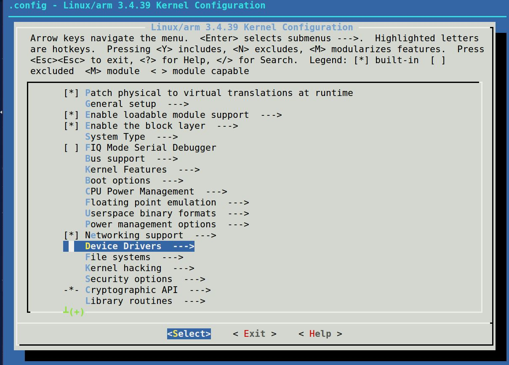
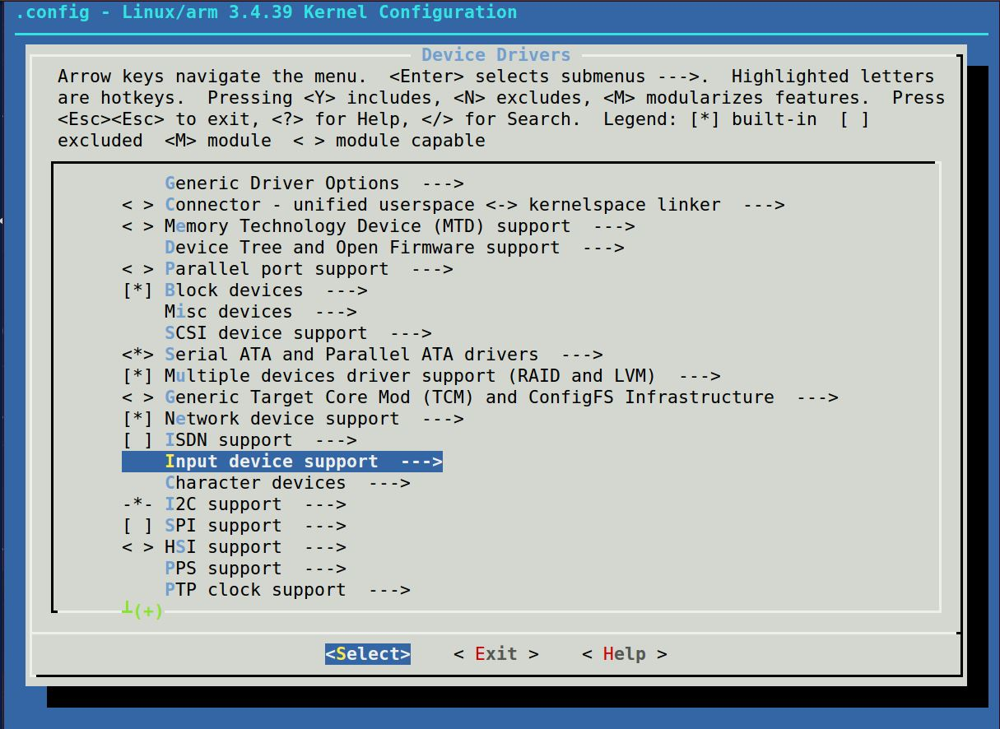
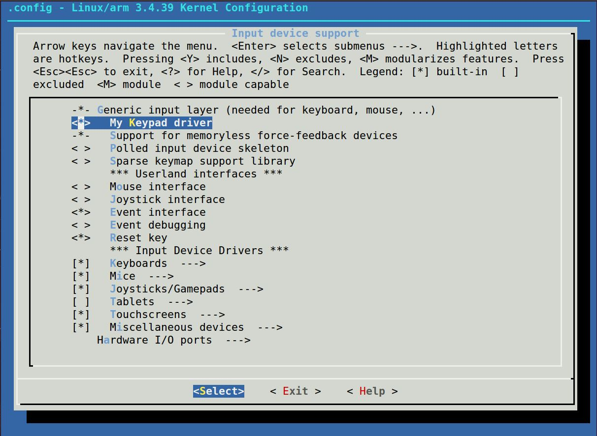

# Input Driver
- 키보드, 터치, 마우스 등, 입력 장치에 대한 설정을 수행한다.
- 입력장치의 데이터 전송 흐름은 단방향이다.
- 하나의 이벤트를 바로 처리하는 것이 아니라, 계층을 만들어서 이벤트에 대한 처리를 수행하도록 한다.
- 다양한 유형의 입력장치를 구분하고, 입력장치에 대한 정보를 통일해서 단일한 드라이버에서 관리한다.
- 각 계층별로 인터페이스를 통해서 관심사를 분리시킨다.
  - 각 계층의 구성은 다음과 같다. 데이터의 흐름은 하단부(입력장치)부터 상단부(응용프로그램)로 흐르게 된다.
  - [응용 프로그램]
  - [입력 이벤트 드라이버]
  - [입력 장치 드라이버]
  - [입력 장치]
  -
- **커널의 코드는 외부에 의존성이 없다.**
  - 예를들면, `strcpy`함수를 사용하고 싶다면, c표준 라이브러리를 사용하는 것이 아니라,
  - 커널내부에 직접적으로 그 함수를 구현해서 사용한다.
  - 이렇게 설계하는 이유는 **안정성**의 측면이 크다.
  - 만약 커널이 외부 라이브러리를 사용한다고 하면, 시스템의 취약점을 이용해서 해킹을 할 가능성이 크다.
  - 결국 **보안**을 위해 이렇게 설계한다.

#### 입력장치 이벤트의 흐름
- 입력장치(마우스, 터치패드, 키보드)에 입력을 발생시킨다.
- 입력장치의 아날로그 입력값을 디지털 데이터로 변환시킨다.(ADC)
- 입력장치 드라이버에서는 입력값을 등록시킨다.(**set**, 구조체의 변수에 값을 할당)
  - 이때 입력값이 담기는 객체의 이름이 **input_dev** 이다.
- 입력이벤트 드라이버에 이벤트를 전송한다.(**register**)
- 이벤트를 구분하기 위해, **sync**를 시킨다.

- **시스템에 등록된 이벤트의 이름을 알고 싶다면 다음 명령어를 내린다.**
  - **`cat /sys/class/input/event#/device/name`**
  - `event#` : #에는 숫자가 들어간다.

#### insmod
- **in store module**
- 디바이스 드라이버를 커널에 동적으로 연결시키도록 도와주는 프로그램.
- 사용 예
  - `insmode devteset.ko`
    - `*.ko` : **kernel object**확장자를 뜻한다.
  - `rmmode devtest.ko`
    - remove module
- 커널이 디바이스 드라이버를 다 가지고 있다면 커널의 사이즈가 커진다.
- 따라서, 모듈형태로 드라이버를 따로 가지고 있다가, 필요할때 커널에 붙이고, 필요없으면 제거시키는 방식으로 작업한다.

#### 디바이스 드라이버의 Makefile
- [참고](./multimedia/EX04-03_platform_driver_input/Makefile)
- 일반 어플리케이션의 Makefile과 설정방법이 매우 다르다

#### 디바이스 드라이버를 커널에 포함시키는 방법.
- `/linux-3.4.39/drivers/input`로 가면 디바이스 드라이버에 메뉴를 설정할 수 있는 파일이 있다.
- `Kconfig`파일에 메뉴를 추가할 수 있다.
  - `bool` : 옵션을 붙여서 커널에 붙이거나 안붙이거나 2개의 상태만 정의가능
  - `tristate` : 옵션을 붙여서 3가지 상태로 만든다.
  - `default` : 커널에 기본 포함.
  - `depend on` : 의존성 파일 정의.

- 예시
  - `cp ~/work/practice/multimedia/EX04-03_platform_driver_input/devtest.c ~/work/linux-3.4.39/drivers/input/mykeypad.c`
  - 명령어를 통해서 **사용자가 만든 디바이스 드라이버를** **커널에 포함**시켰다.
  - 다음은 Kconfig파일에 모듈을 추가한 예이다.
```bash
        config INPUT_MYKPAD
          tristate "My Keypad driver"
          help
            test~
```

- 리눅스 디렉토리에서 들어가서 `make menuconfig` 명령어로 모듈을 커널에 포함시킬지 말지 결정.
  - `<*>` : 커널에 포함
  - `<M>` : 모듈로 사용
  - `< >` : 포함시키지 않음.



- 변경사항이 있다면 다음과 같이 쉘에 출력된다.
```bash
user@user-VirtualBox:~/work/linux-3.4.39$ make menuconfig
scripts/kconfig/mconf Kconfig


*** End of the configuration.
*** Execute 'make' to start the build or try 'make help'.

user@user-VirtualBox:~/work/linux-3.4.39$ vi drivers/in
infiniband/ input/
user@user-VirtualBox:~/work/linux-3.4.39$ vi drivers/in
infiniband/ input/
user@user-VirtualBox:~/work/linux-3.4.39$ vi drivers/input/Makefile
user@user-VirtualBox:~/work/linux-3.4.39$ make menuconfig
^[[Bscripts/kconfig/mconf Kconfig
^[[B

*** End of the configuration.
*** Execute 'make' to start the build or try 'make help'.
```

- 명령어를 통해서 모듈이 포함되었는지 확인한다.
- `cat .config | grep INPUT_MYKPAD`
  - 다음은 설정이 반영된 결과이다.
  - `CONFIG_INPUT_MYKPAD=y`
- 파일을 연 후, 컴파일된 결과를 추가한다.
- `vi drivers/input/Makefile`
  - 다음은 추가한 구문의 예시이다.
  - **주의**
    - config에 추가한 내용과 동일하게 Makefile에 넣어줘야 한다.
    - 파일이름 또한동일 하게 맞춰줘야 한다.
  - `obj-$(CONFIG_INPUT_MYKPAD)  += mykeypad.o`
- 설정이 끝났다면 다음 명령어를 수행한다.
  - `make zImage`
  - 이 명령을 사용해서, 커널을 빌드시킨다.
  - 만약, zImage를 처음 빌드 시키는 것이라면, 다음 명령을 수행한다.
    - `make wt4412_linux_defconfig`
    - 이 명령은 실습보드에서나 적용되는 명령이다.
  - `zImage`가 만들어졌다면 이미지를 `tftpboot`로 옮긴다.
  - `sudo cp arch/arm/boot/zImage /tftpboot/`
- 디바이스 드라이버가 성공적으로 커널에 포함되었고, 실습보드가 부팅될 때, 이 이미지로 부팅이 되었다면, 다음 명령로 디바이스 드라이버가 제대로 잡혔는지 다음 명령어를 통해서 확인한다.
  - `cat /sys/class/input/event1/device/name`
- 부트스크립트 수정(만약 사용자가 만든 프로그램을 부팅시킬때 실행시키고 싶다면.)
  - `rc.loacl` 을 수정한다.
  - `~/work/myrootfs/rootfs/etc/rc.d/rc.loacl`
- 이미지를 다시 만드는 쉘 스크립트를 실행시킨다.
  - `mkext2.sh`
  - 해당 파일은 `~/work/myrootfs` 에 있다.

- [참고 - Kconfig](./multimedia/kernel/Kconfig)
- [참고 - Makefile](./multimedia/kernel/Makefile)
- [참고 - rc.M](./multimedia/kernel/rc.M)
- [참고 - rc.local](./multimedia/kernel/rc.local)
- [참고 - rc.local](./multimedia/kernel/mkext2.sh)
- **rc** 의 의미 : **run command**

#### ADC
- ADC가 10비트의 값이라는 뜻은, 아날로그 인풋을 10bit의 값으로 변환이 가능하다는 뜻이다.
- 즉, 디지털 값으로 바꾸면, 0 ~ 0x3ff 까지의 값을 가질 수 있다.


#### rc
> The ‘rc’ suffix goes back to Unix's grandparent, CTSS.
It had a command-script feature called "runcom". Early
Unixes used ‘rc’ for the name of the operating system's
boot script, as a tribute to CTSS runcom.
