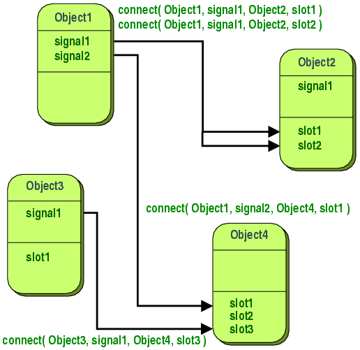

# Qt App


- 우분투에서 실행시킬시, 실행파일 경로를 환경변수에 추가시킨다.

```bash
# 다음을 bash_profile 에 추가해야 함.
PATH=$PATH::/home/user/qtcreator-2.7.1/bin

# shell로 빠져나와서 다음 명령어를 실행
source ~/.bash_profile
## shell 에서  다음 명령어 실행
qtcreator
```
- 우분투에서 작업이끝났다면, 실행파일은 보드로 이동시킨다.
  - `cd ~/work/qt/qt-creator/qdemo/build-qdemo-qt_embedded-Debug`
  - `sudo cp qdemo /nfsroot`

- 보드에서 실행시킬 시, 터치스크린 라이브러리와 qt라이브러리, alsa라이브러리의 환경변수를 세팅하는 작업을 보드 부팅시 1회 진행한다.

```bash
cd /mnt/nfs
source alsa.sh
source tslib.sh
source qt.sh
# qt 실행
./qdemo -qws
```

- qt에서 생성한 프로젝트는 다음 경로에 있다.

```bash
~/work/qt/qt-creator
```

##### QT의 이미지 자원은 BMP, PNG만 렌더링이 가능하다.
- **url : uniform resource locator**
  - 리소스의 위치를 나타내는 것.
- **urn : uniform resource name**
  - 리소스의 이름 그 자체를 유일한 식별자로써 사용하는 방식
- **uri : uniform resource identifier**
  - 모든 정보의 리소스를 가리키는 식별자.
- QT의 리소스 적용방식은 **Cascading**방식을 따른다.
- QT는 `qrc`방식을 통해서 자원(=이미지, 비디오, 음악 등.)을 관리한다.

## QT의 signal/slot system
- 시그널/슬롯 시스템은 오브젝트간 통신을 위해 사용된다.
- `QObject`를 상속받은 모든 클래스에서 이러한 방식을 사용할 수 있다.
- 보통, 오브젝트간 통신에 사용되는 가장 일반적인 방법은 **콜백**을 사용하는 것이다.
- 하지만 위의 방식은 단점이 존재한다.
  - 첫 번째. 콜백은 타입안정성을 제공하지 못한다는 것이다. 콜백 함수를 받은 곳에서 함수를 처리할 때, **형이 일치하는 인자**를 넘겨서 콜백함수를 호출한다는 보장이 없다.
  - 두 번째. 콜백함수(callback)는 그 함수를 받은 함수(processing funtion)와 **강하게 결합**되어 있다. 그렇기 때문에,  processing function은 어떤 콜백함수를 호출해야할지 반드시 알고 있어야 한다.
- [Signals & Slots](http://doc.qt.io/qt-4.8/signalsandslots.html)
> A callback is a pointer to a function, so if you want a processing function to notify you about some event you pass a pointer to another function (the callback) to the processing function. The processing function then calls the callback when appropriate. Callbacks have two fundamental flaws: Firstly, they are not type-safe. We can never be certain that the processing function will call the callback with the correct arguments. Secondly, the callback is strongly coupled to the processing function since the processing function must know which callback to call.

- 이러한 단점을 극복하기 위해서 QT는 signal/slot 시스템을 만들었다.
  - 특정한 이벤트가 발생하면 `signal`이 `emit` 된다.
  - `slot`은 특정 `signal`에 대응되는 `함수`이다.
  - `connect`를 통해서 signal과 slot을 연결한다.


> The signature of a signal must match the signature of the receiving slot.
- signal의 signature는 slot의 signature와 반드시 매치해야 한다.

> Signals and slots are loosely coupled: A class which emits a signal neither knows nor cares which slots receive the signal.
- signal과 slot은 **loosely coupled**되어 있다. 시그널을 발생시키는 클래스는 그 시그널을 받는 slot에 관한 것들을 신경 쓸 필요가 없다.

> All classes that inherit from QObject or one of its subclasses (e.g., QWidget) can contain signals and slots. **Signals are emitted by objects when they change their state in a way that may be interesting to other objects.** This is all the object does to communicate. It does not know or care whether anything is receiving the signals it emits. This is true information encapsulation, and ensures that the object can be used as a software component.
- `QObject`로부터 상속을 받은 클래스들은 signal과 slot 메소드를 가지고 있다.(예를 들면 `QWidget`) 객체가 상태를 바꾸면서 방출한 시그널은 다른 객체한테 영향을 끼치게 된다. 객체는 이러한 방식으로 통신을 한다.

#### Tightly Coupled VS Loosely Coupled
- [강한 결합, 약한 결합](http://www.codesuggestions.com/java/tight-coupling-and-loose-coupling-between-java-objects/)

#### QT
- moc파일은 빌드 파일이다.


-
